# Super Tiny Social Icons
Under 1KB each! Super Tiny Web Icons are minuscule SVG versions of your favourite logos. The average size is *under* 550 bytes!

The logos have a 512x512 viewbox, they will fit in a circle with radius 256. They will scale up and down to suit your needs.

Originally created for my contact page - [https://edent.tel/](https://edent.tel/)

## How Small?

| 747 Bytes SVG	| 3,549 Bytes PNG	|   428 Bytes SVG	| 3,388 Bytes PNG	|  252 Bytes SVG	| 2,581 Bytes PNG	|
|------	        |-----------     	|------	            |----------	        |------	        |-----------	        |
|   	|         	|    	|        	|    	|        	|

## What's Available so far?

<table>
<tr>
<td><br>230 Bytes</td>
<td><br>252 Bytes</td>
<td><br>270 Bytes</td>
<td><br>451 Bytes</td>
<td><br>438 Bytes</td>
<td><br>630 Bytes</td>
</tr>
<tr>
<td><br>326 Bytes</td>
<td><br>354 Bytes</td>
<td><br>372 Bytes</td>
<td><br>370 Bytes</td>
<td>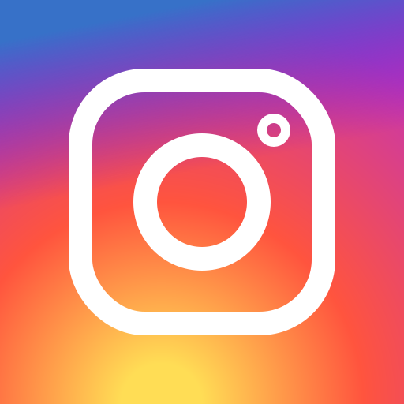<br>316 Bytes</td>
<td><br>544 Bytes</td>
</tr>
<tr>
<td><br>492 Bytes</td>
<td><br>529 Bytes</td>
<td><br>532 Bytes</td>
<td><br>583 Bytes</td>
<td><br>747 Bytes</td>
<td>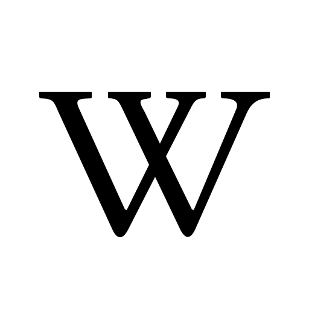<br>608 Bytes</td>
</tr>
<tr>
<td><br>375 Bytes</td>
<td><br>635 Bytes</td>
<td><br>964 Bytes</td>
<td><br>436 Bytes</td>
<td>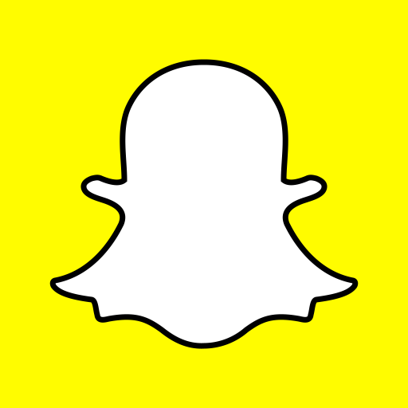<br>619 Bytes</td>
<td><br>674 Bytes</td>
</tr>
<tr>
<td><br>859 Bytes</td>
<td><br>802 Bytes</td>
<td>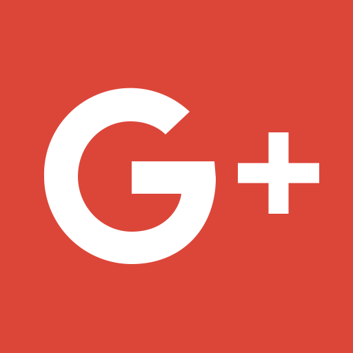<br>374 Bytes</td>
<td><br>765 Bytes</td>
<td><br>423 Bytes</td>
<td><br>383 Bytes</td>
</tr>
<tr>
<td><br>597 Bytes</td>
<td><br>305 Bytes</td>
<td>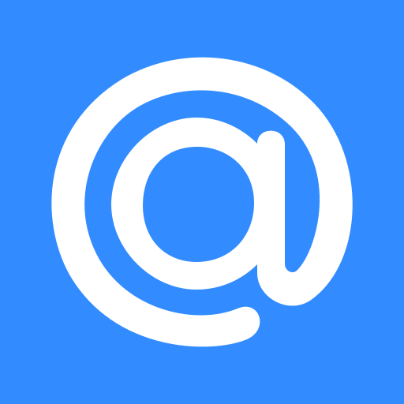<br>573 Bytes</td>
<td><br>379 Bytes</td>
<td>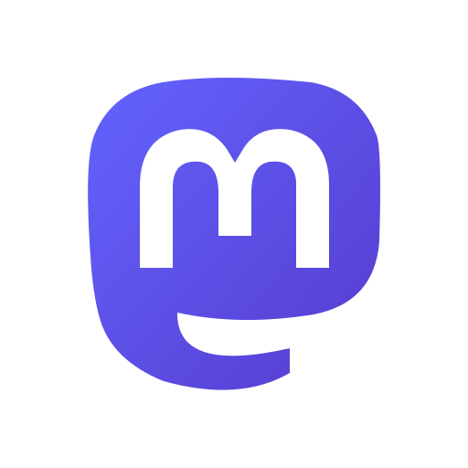<br>664 Bytes</td>
<td><br>286 Bytes</td>
</tr>
<tr>
<td><br>493 Bytes</td>
<td>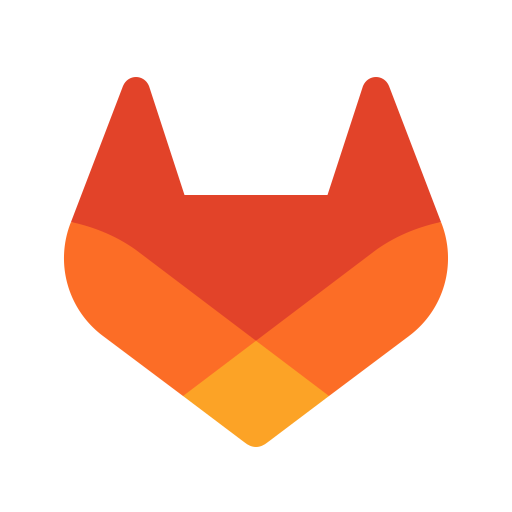<br>288 Bytes</td>
<td><br>632 Bytes</td>
<td>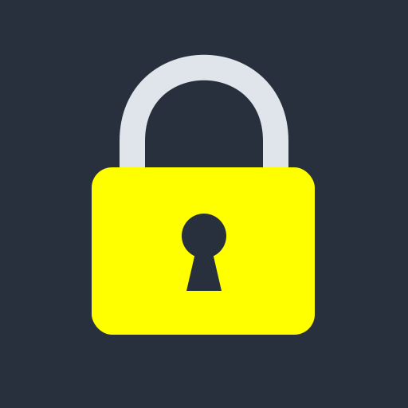<br>405 Bytes</td>
<td><br>399 Bytes</td>
<td><br>634 Bytes</td>
</tr>
<tr>
<td>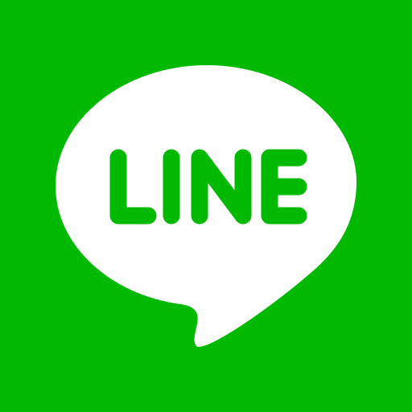<br>479 Bytes</td>
<td><br>325 Bytes</td>
<td><br>269 Bytes</td>
<td><br>393 Bytes</td>
<td>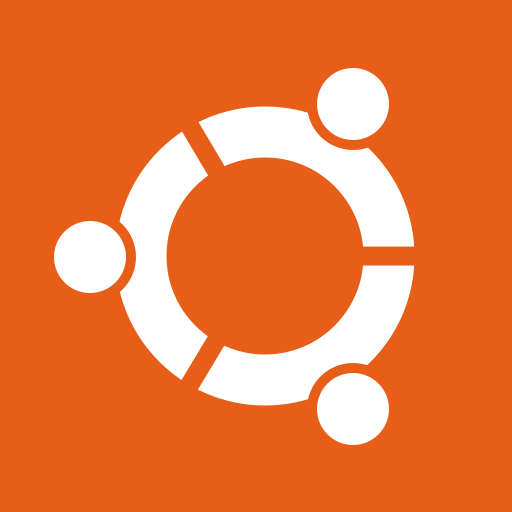<br>634 Bytes</td>
<td><br>658 Bytes</td>
</tr>
<tr>
<td><br>503 Bytes</td>
<td><br>375 Bytes</td>
<td>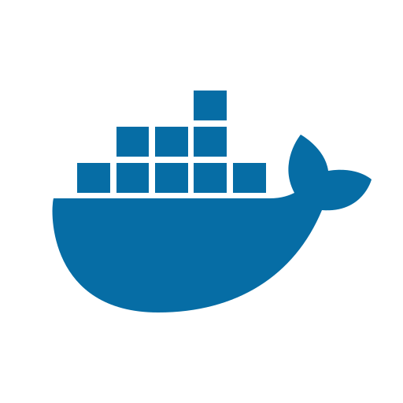<br>526 Bytes</td>
<td>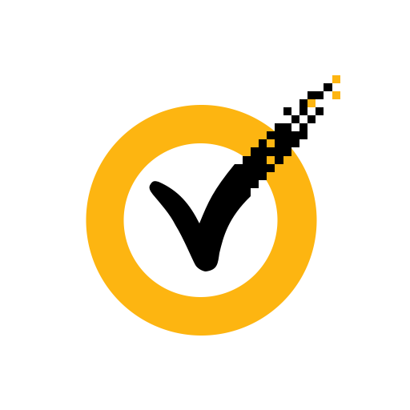<br>966 Bytes</td>
<td>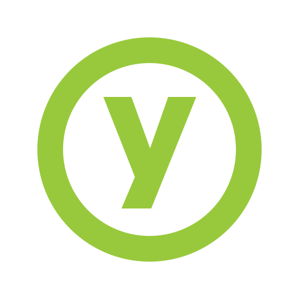<br>313 Bytes</td>
<td><br>1010 Bytes</td>
</tr>
<tr>
<td>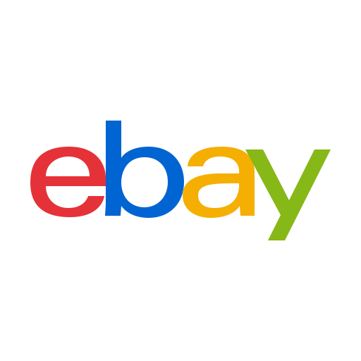<br>830 Bytes</td>
<td><br>799 Bytes</td>
<td>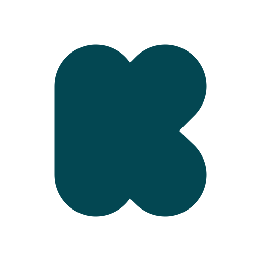<br>308 Bytes</td>
<td><br>575 Bytes</td>
<td><br>529 Bytes</td>
<td><br>255 Bytes</td>
</tr>
<tr>
<td><br>937 Bytes</td>
<td>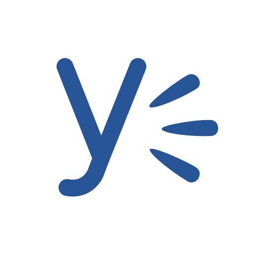<br>946 Bytes</td>
<td><br>557 Bytes</td>
<td><br>402 Bytes</td>
<td><br>507 Bytes</td>
<td><br>569 Bytes</td>
</tr>
<tr>
<td><br>638 Bytes</td>
<td><br>267 Bytes</td>
<td><br>691 Bytes</td>
<td><br>379 Bytes</td>
<td><br>572 Bytes</td>
<td><br>648 Bytes</td>
</tr>
<tr>
<td><br>270 Bytes</td>
<td><br>398 Bytes</td>
<td><br>273 Bytes</td>
<td><br>256 Bytes</td>
<td><br>251 Bytes</td>
<td>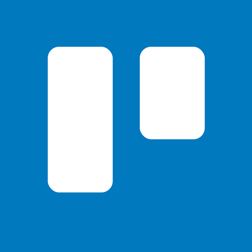<br>276 Bytes</td>
</tr>
<tr>
<td><br>983 Bytes</td>
<td><br>286 Bytes</td>
<td>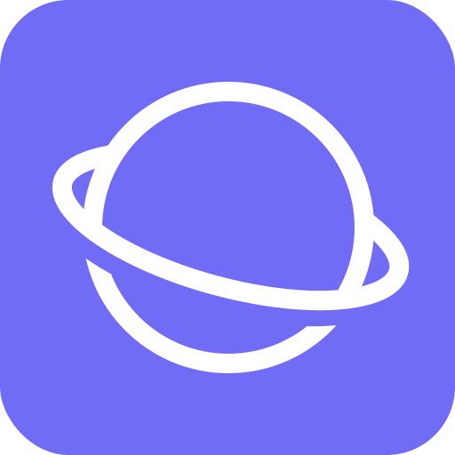<br>943 Bytes</td>
<td><br>879 Bytes</td>
<td>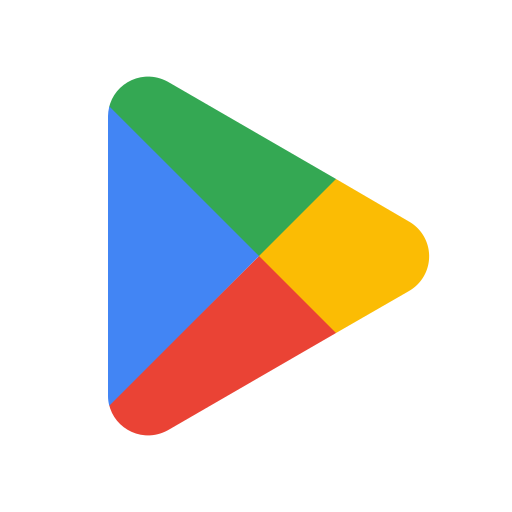<br>509 Bytes</td>
<td><br>745 Bytes</td>
</tr>
<tr>
<td>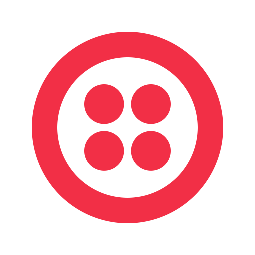<br>395 Bytes</td>
<tr>
</table>

## Why so smallious?

Bytes cost money.  They cost money to store, transport, and process.  Simplicity should be our goal in all endeavours.

## Scream if you want to go smaller

These files were edited by hand in Inkscape, then were minified using [svgo](https://github.com/svg/svgo) and [svgcleaner](https://github.com/RazrFalcon/svgcleaner). Further smallification may be possible. Try it!

* Each of these has an `xmlns="http://www.w3.org/2000/svg"` in the `<svg>` tag. This isn't strictly necessary - but some web browsers won't display them as an image without it.
* Rounded corners can be dropped - `rx="80"` - the effect can be done in CSS if you want.
* The background colour can also be excluded if you're including it elsewhere.
* Colours can be simplified. `#FF0000` becomes `red`.
* The precision of the paths is *mostly* 0 decimal places. A few logos have 1 or 2 dp to make them look more accurate. The precision can be reduced if necessary.

Think you can make them smaller? Tell me by raising an issue!

Want more icons?  Tell me by raising an issue!

Think the icons look wrong?  [Compare them against the official logos](https://github.com/edent/SuperTinyIcons/blob/master/images/reference/index.md). If they still look wrong, tell me by raising an issue!

**New!** Icons also available in [Android Vector Drawables](https://developer.android.com/guide/topics/graphics/vector-drawable-resources.html) so you can easily use them in Android apps. Converted using https://inloop.github.io/svg2android/ - not guaranteed to be under 1KB.

## Icon accessibility

The super tiny icons are accessible by default. Each icon has:
* `role="img"`, to expose the ```<svg>``` elements as images in the browser's accessibility tree
* `aria-label="XYZ"` (where XYZ is the icon's brand name), to give the icon an accessible name

`Note:` if using the ```<svg>``` as the `src` for an `````` element, the `alt` attribute should still be used on the `````` element because the ARIA is not recognised in this context.

## Submitting Icons

I'd *love* you to submit something 😸 The rules are simple, your icon must:

* be **under** 1024 bytes. That is, the maximum file size is 1023 bytes. No arguments.
* fit inside a circle with radius 256 pixels. Set `rx="50%"` to check.
* have solid colours. No gradients or fades.
* represent a popular service's current logo.

### Guidelines

This is the standard guideline. Use this to help with sizing your icons and they will look good no matter what border radius is chosen.


* **Green** is the safe zone, where the main body of the icon should be.
* **Yellow** is like a road shoulder, it is there if more space is needed. It should be used for protruding elements, like corners or ornaments.
* **Red** is off limits. It should not be touched by the icons. Red is also how a circular icon would look.

To see how the logos look, you can [play around with the corner radius size using our interactive tool](https://edent.github.io/SuperTinyIcons/radius.html)

## Licenses

The majority of these vector logos are based on someone else's work.

* [Social Media Icons by Aha-Soft](https://www.iconfinder.com/iconsets/social-flat-rounded-rects) - CC-BY
* [Phone Icon](https://www.iconfinder.com/icons/1807538/phone_icon#size=128) - Free
* [Lock Icon](https://www.iconfinder.com/icons/1814107/lock_padlock_secure_icon#size=512) - MIT
* [Wire Logo](https://commons.wikimedia.org/wiki/File:Wire_software_logo.svg) - Public Domain
* [Signal Logo](https://github.com/WhisperSystems/Signal-iOS/blob/master/Signal/Images.xcassets/logoSignal.imageset/logoSignal.pdf) - GPLv3
* [RSS Icon](https://commons.wikimedia.org/wiki/File:Generic_Feed-icon.svg) - MPL 1.1
* [PDF Icon](https://www.iconfinder.com/iconsets/line-icons-set) - Free
* [Google+](https://commons.wikimedia.org/wiki/File:Google_Plus_logo_2015.svg) - Public Domain
* [Google](http://svgshare.com/s/q)
* [Mastodon](https://github.com/tootsuite/mastodon/blob/0ad694f96b7f0e951950e7525bde52cd11454cb2/app/assets/images/logo.svg) - AGPLv3
* [GitLab](https://about.gitlab.com/press/)
* [HTML5 Shield](https://www.w3.org/html/logo/) - CC-BY
* [NPM Logo](https://commons.wikimedia.org/wiki/File:Npm-logo.svg) - CC-BY
* [Docker Logo](https://github.com/docker/docker.github.io/blob/master/LICENSE) - Apache
* [Steam](https://commons.wikimedia.org/wiki/File:Steam_icon_logo.svg)
* [Symantec](https://commons.wikimedia.org/wiki/File:Symantec_logo10.svg)
* [Yubico](https://github.com/Yubico/yubikey-manager-qt/blob/master/resources/icons/ykman.png) - BSD
* [Keybase](https://github.com/keybase/client/blob/master/shared/images/iconfont/kb-iconfont-keybase-16.svg) - BSD
* [ebay](https://commons.wikimedia.org/wiki/File:EBay_logo.svg)
* [Kickstarter](https://www.kickstarter.com/help/brand_assets)
* [Yahoo!](https://commons.wikimedia.org/wiki/File:Yahoo!_logo.svg)
* [BitCoin](https://commons.wikimedia.org/wiki/File:Bitcoin_logo.svg) - CC0
* [Bluetooth](https://commons.wikimedia.org/wiki/File:Bluetooth.svg)
* [Blogger](https://commons.wikimedia.org/wiki/File:Blogger_icon.svg)
* [Medium](https://medium.design/logos-and-brand-guidelines-f1a01a733592)
* [Ghost](https://commons.wikimedia.org/wiki/File:Ghost-Logo.svg)
* [tumblr](https://www.tumblr.com/logo)
* [intel](https://commons.wikimedia.org/wiki/File:Intel-logo.svg)
* [Badoo](https://team.badoo.com/new/)
* [YouTube](https://www.youtube.com/yt/about/brand-resources/#logos-icons-colors)
* [Google Play](https://commons.wikimedia.org/wiki/File:Google_Play_symbol_2016.svg)
* [Gmail](https://commons.wikimedia.org/wiki/File:Gmail_Icon.svg)
* [Samsung Internet](https://github.com/edent/SuperTinyIcons/pull/74/commits/8824bdaf1346a472ab425347f958e8e64c0948ee)

From [SVGporn](https://github.com/gilbarbara/logos/) - CC0

IBM, Yammer, Android, Authy, ClourFlare, CodePen, DigitalOcean, Discord, AirBnB, WiFi, delicious, opensource, Patreon

Where possible, they retain their original licenses.  Some logos may be subject to copyright and trademark laws, but these files are small enough to memorise.
